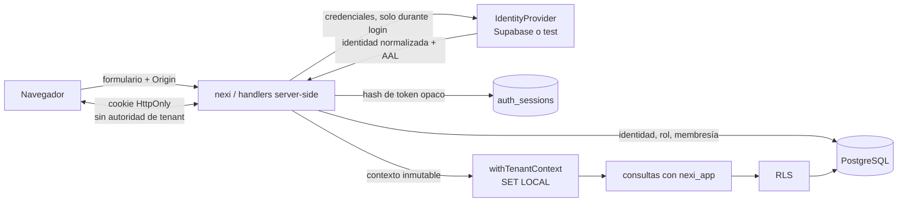

# Etapa 5: autenticación, sesiones y tenant confiable

- Proyecto interno: Longhorn
- Marca comercial: nexi
- Fecha: 2026-07-25
- Estado: implementada y validada localmente; CI reproducible configurado

## A. Resumen ejecutivo

Se sustituyó el ingreso demostrativo por autenticación server-side. Supabase
Auth quedó seleccionado como proveedor productivo mediante un adaptador; CI y
local usan un proveedor sintético prohibido por configuración fuera de esos
ambientes. Longhorn no almacena contraseñas.

La aplicación crea sesiones opacas revocables en PostgreSQL, vincula la
identidad externa con `users`, distingue `client_admin` de `nexi_admin`,
selecciona tenants solo después de comprobar `tenant_memberships` y conserva el
contexto transaccional RLS de la Etapa 4. Se implementaron recuperación,
concesiones de un solo uso, MFA obligatorio para personal interno, auditoría,
rate limiting, pruebas HTTP E2E y CI. No se crearon dashboards funcionales.

## B. Validación de prerrequisitos

Antes de modificar se comprobó PostgreSQL 17.10 sano, migraciones reversibles
desde vacío, roles `nexi_migrator`/`nexi_app` separados, ausencia de
`BYPASSRLS`, RLS activa, fallo cerrado sin contexto, aislamiento A/B, limpieza
del contexto al reutilizar conexión y `pnpm verify` aprobado.

## C. Proveedor seleccionado

| Alternativa | Evaluación | Decisión | Motivo |
| --- | --- | --- | --- |
| Supabase Auth | HTTP, recuperación, TOTP gratuito, free tier | Seleccionado | Mejor relación seguridad/operación/costo |
| OIDC gestionado | Portable, costo futuro variable | Compatible mediante otro adaptador | No necesario para V1 |
| Keycloak | Completo y sin licencia | Diferido | Añade servicio, parches y monitoreo |
| Propio | Máximo control | Rechazado | Riesgo de credenciales injustificado |
| Simulado | Determinista | Solo local/CI | Pruebas sin servicio productivo |

## D. Arquitectura de autenticación

## E. Cambios de base de datos

| Tabla o migración | Cambio | Propósito | Riesgo |
| --- | --- | --- | --- |
| `0003_authentication_and_sessions` | identidades, staff, sesiones, auditoría, límites | Base de autenticación | Funciones privilegiadas requieren revisión |
| `0004_password_recovery_controls` | revocación global y auditoría de reset | Invalidar sesiones | Reset exige reingreso |
| `0005_membership_roles` | `role=client_admin` y revocación por cambio | Rol mínimo explícito | Solo existe un rol tenant |
| `0006_auth_context_and_recovery_replay` | identidad en sesión, grant de un uso, scopes | Contexto y anti-replay | Requiere limpieza operativa futura |
| `auth_identities` | vínculo proveedor-sujeto-usuario | Portabilidad | Provisionamiento debe ser atómico |
| `platform_staff` | `nexi_admin` global | Separar staff de tenants | Alta sensibilidad |
| `auth_sessions` | token hash, audiencia, AAL, tenant, expiración/revocación | Sesión server-side | Crecimiento de historial |
| `auth_recovery_grants` | nonce hash, expiración, consumo | Un solo uso | Filas expiradas deben purgarse |
| `auth_audit_events` | eventos persistentes sin secretos | Evidencia | Retención aún no definida |
| `auth_rate_limits` | ventanas distribuidas en PostgreSQL | Ant abuso V1 | Costo de escritura |

Todas las tablas de autenticación niegan acceso directo a `nexi_app`; se usan
funciones mínimas `SECURITY DEFINER` con `search_path` fijo. Las tablas
tenant-scoped originales mantienen RLS.

## F. Identidad y perfiles

`auth_identities(provider, provider_subject, provider_email, user_id)` enlaza
una identidad verificada con `users`. La identidad normalizada contiene
proveedor, sujeto, correo verificado y AAL. No se persisten contraseñas, hashes,
refresh tokens, códigos MFA ni tokens de recuperación.

## G. Administrador nexi

El personal interno se representa en `platform_staff`, fuera de
`tenant_memberships`. `/nexi-interno/ingresar` no está enlazado públicamente.
Para crear sesión debe existir el vínculo de identidad, usuario y staff activos,
rol `nexi_admin` y AAL2. La ruta protegida repite la comprobación server-side.

## H. Cliente Administrador

La membresía exige estado `active` y rol fijo `client_admin`. Un usuario sin
membresía no obtiene sesión cliente. Desactivar o modificar una membresía
revoca sus sesiones. Un tenant conocido o enviado manualmente solo se convierte
en contexto si la función PostgreSQL confirma la membresía.

## I. Sesiones

- Creación: 256 bits aleatorios después de autenticar y autorizar.
- Cookie: HttpOnly, SameSite Strict, Path `/`; Secure y prefijo `__Host-` en
  staging/producción.
- Base: solo SHA-256 del token, identidad, audiencia, AAL, tenant y metadatos
  seudonimizados.
- Expiración: ocho horas cliente y dos horas staff por defecto.
- Renovación: no hay renovación deslizante; se exige un login nuevo al expirar.
- Rotación: seleccionar tenant emite token nuevo y revoca el anterior.
- Revocación: logout, reset y cambio de membresía.
- Validación: usuario, identidad, staff/membresía, tenant, expiración y
  revocación se consultan server-side.

## J. Recuperación y MFA

La solicitud responde siempre de forma genérica y usa una URL canónica, no
`Host` ni redirects del usuario. Supabase valida su token de recuperación; nexi
lo encapsula en una cookie cifrada de diez minutos vinculada a un nonce cuyo
hash se consume atómicamente una sola vez. El cambio revoca todas las sesiones.

Supabase TOTP se verifica completamente en el servidor y el área interna exige
AAL2. El adaptador de pruebas reproduce el contrato sin aparentar MFA
productivo. La inscripción y recuperación del factor inicial permanecen como
paso de provisionamiento asistido; antes de staging debe validarse el
procedimiento con un proyecto Supabase real.

## K. Resolución del tenant

- Un tenant: se selecciona automáticamente tras validar membresía.
- Varios: la sesión nace sin tenant y muestra una selección técnica.
- Selección válida: se valida, rota sesión y establece el tenant server-side.
- Inválido/ajeno: PostgreSQL rechaza y se audita; la cookie no concede acceso.
- Sitio público: `public-host.ts` solo normaliza/clasifica el host; todavía no
  resuelve dominios ni crea contexto.
- Staff: nunca usa `tenant_memberships` ni adopta tenant automáticamente.

## L. Seguridad

- CSRF: Origin canónico obligatorio, cookies Strict y sin CORS con credenciales.
- Redirects: rutas fijas derivadas de `APP_URL`; parámetros externos se ignoran.
- Rate limiting: PostgreSQL por IP seudonimizada, identidad y endpoint.
- Fixation: token nuevo en login y rotación al escoger tenant.
- Replay: logout/revocación, expiración y recovery grant de consumo único.
- Logging: el logger redacta password, cookie, authorization, token y secret.
- Auditoría: persistente y separada del log operativo.
- Secretos: solo variables server-side; el adaptador test falla fuera de
  `local/test`.

## M. Rutas

| Ruta o grupo | Público | Autenticado | Rol | Observaciones |
| --- | --- | --- | --- | --- |
| `/` | Sí | No | — | Solo enlaza ingreso cliente |
| `/ingresar` | Sí | No | Cliente | Login real |
| `/recuperar-clave` | Sí | No | — | Respuesta genérica |
| `/restablecer-clave` | Condicional | Grant corto | — | Cookie cifrada |
| `/seleccionar-empresa` | No | Sí | `client_admin` | Membresías activas |
| `/cuenta` | No | Sí | `client_admin` | Pantalla técnica mínima |
| `/nexi-interno/ingresar` | No enlazada | No | Staff | Password + TOTP |
| `/nexi-interno` | No | Sí | `nexi_admin`, AAL2 | Pantalla mínima |
| `/api/auth/*` | Endpoint | Según acción | Variable | Origin y rate limits |
| `/api/health` | Sí | No | — | Sin datos de auth |

## N. Archivos modificados

| Archivo | Cambio | Motivo | Riesgo |
| --- | --- | --- | --- |
| `site/db/migrations/0003..0006_*` | Modelo y funciones de seguridad | Persistencia verificable | SQL privilegiado |
| `site/scripts/db/seed.ts` | tenants/usuarios/identidades ficticios | Tests reproducibles | Solo local/CI |
| `site/src/auth/*` | adaptadores, sesión, HTTP, contexto | Núcleo Etapa 5 | Superficie sensible |
| `site/src/tenancy/public-host.ts` | contrato de host | Compatibilidad futura | No resuelve DB aún |
| `site/app/api/auth/*` | handlers | Flujos reales | Deben seguir server-side |
| `site/app/{ingresar,cuenta,...}` | UI mínima | Demostrar actores | No es dashboard |
| `site/app/page.tsx` | login real y retiro del panel demo | Evitar bypass visual | Bajo |
| `site/app/globals.css` | estilos auth | Conservar marca | Bajo |
| `site/tests/*` | unitarias, DB, integración, E2E | Evidencia | Datos sintéticos |
| `site/package.json` | comandos | Operación reproducible | Bajo |
| `site/.env.example` | contrato de configuración | Fail-fast | No contiene valores reales |
| `.github/workflows/ci.yml` | auth y E2E | Evitar regresiones | Más tiempo CI |
| `docs/adr/ADR-010-*` | decisión | Trazabilidad | Bajo |

## O. Variables de entorno

- `AUTH_PROVIDER`: `supabase` o `test`.
- `AUTH_SECURITY_PEPPER`: HMAC y cifrado de grants.
- `AUTH_SESSION_TTL_SECONDS`: vida máxima cliente.
- `AUTH_ADMIN_SESSION_TTL_SECONDS`: vida máxima staff.
- `SUPABASE_URL`: API server-side del proyecto.
- `SUPABASE_PUBLISHABLE_KEY`: identificación API server-side.
- `AUTH_TEST_IDENTITIES`: identidades efímeras local/CI.
- `AUTH_TEST_RECOVERY_TOKEN`: token sintético local/CI.
- `APP_URL`: origen y redirects canónicos.
- `DATABASE_URL`: rol restringido.
- `DATABASE_MIGRATION_URL`: solo migraciones/seeds/tests administrativos.

## P. Pruebas ejecutadas

| Prueba | Resultado | Evidencia |
| --- | --- | --- |
| `pnpm test:unit` | Aprobada | configuración, cifrado, Origin y hosts |
| `pnpm test:db` | Aprobada | ida/vuelta desde vacío y RLS |
| `pnpm test:tenant-isolation` | Aprobada | A/B y pool sin fuga |
| `pnpm test:auth` | Aprobada | login, sesiones, recuperación, MFA, rate limit |
| `pnpm test:e2e` | Aprobada | servidor Vinext HTTP real |
| `pnpm verify` | Aprobada | lint, tipos, pruebas, build y secretos |
| `pnpm security:audit` | Sin nueva consulta | el sandbox bloqueó egress; último resultado de Etapa 4 aprobado y sin cambios de dependencias |

## Q. Evidencia de aislamiento

Autorizados: identidad A → tenant A; identidad multiempresa → tenants A/B;
staff AAL2 → ruta interna sin tenant. Rechazados: A → tenant B; multiempresa →
tenant C conocido; cliente → ruta interna; usuario desactivado; membresía
desactivada; sesión expirada/revocada; origen externo. El mismo UUID conocido
no altera el resultado.

## R. Integración continua

GitHub Actions inicia PostgreSQL 17.10, crea roles, aplica migraciones, carga
seeds, prueba migraciones/RLS, ejecuta `verify`, `test:auth`, `test:e2e` y el
audit. El proveedor sintético recibe credenciales generadas en memoria. No se
conecta Supabase, no se envían correos y no se despliega.

## S. Problemas encontrados

Corregidos:

- login que aceptaba cualquier credencial;
- enlace público al panel demostrativo;
- falta de sesión/revocación/roles;
- recuperación reutilizable;
- ausencia de selección multiempresa verificable;
- migraciones down con eventos de auditoría nuevos.

Heredados:

- metadatos sociales aún construyen URL desde `Host`; no se reutilizó en auth;
- estilos del prototipo incluyen reglas del panel demo ya no accesible;
- advertencias heredadas por `` permanecen fuera del alcance.

Bloqueantes:

- ninguno funcional; queda confirmar el audit en CI con acceso al registro npm.

Diferidos:

- conexión y prueba contra un proyecto Supabase real;
- SMTP productivo;
- limpieza/retención programada de sesiones, grants, límites y auditoría.

## T. Deuda técnica

- Validar inscripción y recuperación TOTP asistida con Supabase real.
- Definir retención/purga de tablas de seguridad.
- Añadir webhook o reconciliación de revocaciones originadas en el proveedor.
- Probar el adaptador Supabase en staging sin reutilizar datos productivos.
- Sustituir el contrato de host por dominios verificados cuando se autorice.

## U. Diferencias frente al plan

- Se usó la API HTTP de Supabase en vez de incorporar su SDK; reduce
  acoplamiento y evita tokens en componentes cliente.
- La sesión no se renueva silenciosamente; expira y obliga a reautenticar.
- El enrolamiento TOTP no es autoservicio: forma parte del provisionamiento
  interno y el acceso queda bloqueado hasta alcanzar AAL2.
- La resolución pública por host quedó como contrato puro, sin tablas de
  dominios, respetando el alcance.

## V. Riesgos pendientes

Antes de paneles o staging se debe crear el proyecto Supabase, restringir URLs,
configurar la plantilla `token_hash`, verificar TOTP de principio a fin, definir
el bootstrap del primer administrador y ejecutar una revisión de las funciones
`SECURITY DEFINER`. Antes de producción también se requiere estrategia de
backup, retención, purga y observabilidad de abuso.

## W. Recomendación de la siguiente etapa

La siguiente etapa debe implementar el esqueleto y los casos de uso mínimos del
panel del Administrador nexi usando el contexto y las autorizaciones ya
creadas. No debe ampliar roles, pagos, dominios ni contenido hasta aprobar ese
alcance.
