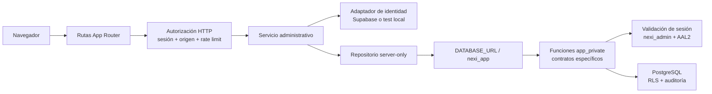

# Etapa 6: panel base del Administrador nexi

Fecha de cierre: 2026-07-25<br>
Estado: **aprobada con deuda no bloqueante**

## A. Resumen ejecutivo

Quedó operativo el primer back office del Administrador nexi. Una sesión
vigente de audiencia `nexi_admin` y nivel AAL2 puede consultar indicadores
reales, buscar clientes, crear tenants `draft`, editar sus datos permitidos,
activar, suspender y reactivar, gestionar invitaciones `client_admin`,
desactivar o reactivar membresías y consultar auditoría paginada.

El navegador y las rutas HTTP no reciben un rol ni un actor confiable desde el
cliente. Las solicitudes web usan `DATABASE_URL` con `nexi_app`; PostgreSQL
vuelve a validar sesión, usuario, personal interno y AAL2 mediante funciones
específicas. No se concedió acceso directo a las tablas globales nuevas.

Durante el cierre 6B se corrigieron cuatro brechas:

1. Se retiró una función privilegiada de expiración que no validaba actor.
2. Se agregó el filtro faltante de auditoría por resultado.
3. Supabase ahora falla al iniciar si falta `SUPABASE_SECRET_KEY`.
4. La aceptación de invitaciones se prueba con dos solicitudes concurrentes.

También se retiraron “Longhorn” y “AAL2” de texto visible. No se implementaron
sitios, plantillas, planes, pagos, dominios, mensajería, onboarding ni tienda.

La deuda no bloqueante está limitada a validaciones de staging, auditoría npm
online bloqueada por el entorno, complejidad de algunos archivos y una
incompatibilidad local entre el servidor de producción de Vinext y directorios
de build marcados por OneDrive como puntos de reanálisis.

## B. Validación de la Etapa 5

| Validación | Resultado actual | Evidencia |
| --- | --- | --- |
| PostgreSQL y RLS | 8/8 | `pnpm test:db` |
| Autenticación y contrato de identidad | 19/19 | `pnpm test:auth` |
| E2E Cliente Administrador y Administrador nexi | 2/2 | `pnpm test:auth-e2e` |
| Rol `nexi_admin` exige AAL2 | Aprobado | Login sin TOTP rechazado; sesión AAL2 aceptada |
| `client_admin` no entra al panel | Aprobado | Llamada HTTP directa redirigida al acceso interno |
| Sesión revocada | Aprobado | Logout y relectura de ruta protegida |
| `nexi_app` sin `BYPASSRLS` | Aprobado | Catálogo PostgreSQL y `pnpm db:check` |
| Rol de migración fuera de web | Aprobado | Repositorio admin usa solo `withApplicationDatabase` |
| Proveedor test fuera de local/test | Aprobado | Prueba explícita de configuración productiva |
| Ruta interna no enlazada desde landing | Aprobado | Revisión de `app/page.tsx` y navegación renderizada |
| `pnpm verify` | Aprobado | Ejecución final registrada en la sección N |

## C. Arquitectura del panel



Las páginas y layouts son Server Components por defecto. Solo los controles que
necesitan estado de formulario o vista previa de slug son Client Components.

## D. Acceso administrativo a datos

| Elemento | Decisión |
| --- | --- |
| Rol web | `nexi_app` mediante `DATABASE_URL` |
| Superusuario | No |
| `BYPASSRLS` | No |
| `CREATEDB` / `CREATEROLE` | No |
| Rol de migración en HTTP | No |
| Acceso a tablas nuevas | Sin privilegios directos |
| Acceso global autorizado | Funciones `app_private` con firma cerrada |
| Propietario de funciones | `nexi_migrator` |
| `search_path` | `pg_catalog` en todas las funciones revisadas |
| Actor | Derivado de la sesión server-side y revalidado en PostgreSQL |

Las funciones administrativas llaman a
`app_private.require_nexi_admin_session`, que verifica sesión no revocada,
vigencia, audiencia, AAL2, usuario activo y asignación activa en
`platform_staff`. Un `client_admin`, una sesión conocida pero revocada o un UUID
manipulado no conceden acceso.

`accept_tenant_invitation` no requiere sesión administrativa porque opera sobre
una prueba de identidad verificada por el adaptador. Su alcance queda limitado
por proveedor, referencia, correo, estado y expiración de una invitación
preexistente.

La decisión completa está en
[ADR-011](adr/ADR-011-operaciones-administrativas-postgresql.md).

## E. Navegación implementada

| Sección | Ruta | Protección | Funciones |
| --- | --- | --- | --- |
| Acceso interno | `/nexi-interno/ingresar` | Público, login server-side con TOTP | Iniciar sesión interna |
| Inicio | `/nexi-interno` | `nexi_admin` + AAL2 | Métricas y actividad real |
| Clientes | `/nexi-interno/clientes` | `nexi_admin` + AAL2 | Buscar, filtrar, ordenar, paginar |
| Nuevo cliente | `/nexi-interno/clientes/nuevo` | `nexi_admin` + AAL2 | Crear tenant `draft` |
| Detalle | `/nexi-interno/clientes/[tenantId]` | `nexi_admin` + AAL2 | Editar, estado, invitación, membresías, actividad |
| Invitaciones | `/nexi-interno/invitaciones` | `nexi_admin` + AAL2 | Filtrar, renovar y revocar |
| Auditoría | `/nexi-interno/auditoria` | `nexi_admin` + AAL2 | Filtros y paginación de solo lectura |
| Aceptación | `/invitacion/aceptar` | Token verificado server-side | Aceptar una invitación activa |
| Mutaciones | `/api/admin/actions` | Sesión, AAL2, origen, rate limit y DB | Operaciones administrativas cerradas |
| Aceptación API | `/api/invitations/accept` | Origen, rate limit y proveedor | Verificar token y crear/vincular acceso |

No existen enlaces públicos al panel interno.

## F. Modelo de datos

| Tabla o cambio | Propósito | Alcance | RLS / privilegios | Riesgo |
| --- | --- | --- | --- | --- |
| `tenants.status` | Agrega `draft` | Global de plataforma | RLS existente | Bajo |
| `tenants_slug_not_reserved` | Bloquea slugs operativos | Global | Constraint | Bajo |
| `tenant_invitations` | Ciclo de invitaciones | Relacionado con tenant | RLS habilitado; sin grants directos | Medio |
| `platform_idempotency_keys` | Deduplicar creación | Global | RLS habilitado; sin grants directos | Bajo |
| `platform_audit_events` | Auditoría append-only | Global autorizado | RLS habilitado; sin grants directos | Medio |
| `auth_rate_limits` | Nuevos scopes admin | Global técnico | Funciones existentes | Bajo |
| Trigger de membresía | Revoca solo la sesión del tenant afectado | Tenant-scoped | `search_path` fijo | Medio |
| Funciones `app_private.admin_*` | Acceso mínimo global | Global autorizado | `SECURITY DEFINER` específico | Alto si se generaliza |

No se crearon tablas de sitios, planes, pagos, dominios, mensajes, onboarding o
comercio.

## G. Flujo de tenant

### Creación

- El nombre se normaliza y limita a 120 caracteres.
- El slug se normaliza, valida, compara con la lista reservada y protege con
  unicidad.
- Zona horaria y locale se seleccionan de listas permitidas.
- El estado inicial es `draft`.
- Una clave UUID y un fingerprint SHA-256 hacen la operación idempotente.
- La transacción crea tenant, guarda resultado idempotente y agrega auditoría.
- No crea sitio, plantilla, dominio ni cobro.

### Edición

Solo modifica nombre visible, slug, zona horaria y locale. Usa
`expected_updated_at` y un bloqueo de fila para detectar concurrencia. Registra
estado anterior y nuevo.

### Suspensión

Exige motivo, conserva datos y membresías, cambia el estado en transacción y
revoca únicamente sesiones `client_admin` cuyo `active_tenant_id` corresponde
al tenant suspendido. No afecta otras empresas del usuario.

### Reactivación

Admite `draft -> active` y `suspended -> active`, no duplica registros y agrega
un evento auditado. El acceso posterior depende además de una membresía activa.

## H. Flujo de invitación

Estados controlados:

```text
failed -> pending -> accepted
   |         |  \
   |         |   -> revoked
   |         -> expired
   -> renovación controlada -> pending
```

1. El Administrador nexi reserva una invitación idempotente.
2. El adaptador de identidad genera la referencia.
3. PostgreSQL almacena la referencia, no el token ni el enlace.
4. En local/test, el token sintético se muestra solo para la prueba.
5. En aceptación, el proveedor valida identidad, proveedor, asunto y correo.
6. PostgreSQL bloquea la invitación con `FOR UPDATE`.
7. Se crea o reutiliza usuario e identidad.
8. Se crea o reactiva una sola membresía `client_admin`.
9. La invitación queda `accepted` y se agregan eventos.

Dos aceptaciones concurrentes del mismo token aprobaron y devolvieron la misma
membresía, sin duplicar usuario, identidad o membresía.

Supabase real requiere antes de staging configurar la plantilla de correo para
entregar `token_hash` al endpoint de aceptación server-side, autorizar la URL de
redirección y alinear la expiración OTP del proyecto con la expiración local.

## I. Membresías

El panel lista exclusivamente membresías `client_admin`. Las transiciones
permitidas son `active <-> disabled`; no existe eliminación física ni cambio a
`nexi_admin`.

La función recibe un `membership_id`, obtiene tenant y rol desde PostgreSQL,
rechaza otros roles y registra estado previo, estado nuevo, actor, motivo y
correlation ID. El trigger revoca únicamente sesiones de ese usuario para el
tenant afectado.

## J. Auditoría

Eventos implementados:

- `tenant_created`, `tenant_updated`, `tenant_activated`,
  `tenant_suspended`, `tenant_reactivated`;
- `invitation_created`, `invitation_resent`, `invitation_failed`,
  `invitation_revoked`, `invitation_accepted`;
- `membership_created`, `membership_disabled`, `membership_reactivated`;
- `admin_access_denied`.

Cada evento guarda los campos aplicables: actor, tenant, acción, recurso,
resultado, timestamp, correlation ID, motivo y estados anterior/nuevo.

La aplicación no tiene `UPDATE` ni `DELETE` directo sobre la tabla. La vista
permite filtrar server-side por acción, tenant, actor, fechas y resultado, con
límite de 20 filas por página. Las pruebas confirman que `nexi_app` no puede
editar auditoría ni leer directamente invitaciones.

No se registran tokens, cookies, contraseñas, claves, OTP ni enlaces completos.

## K. Archivos modificados

| Archivo o grupo | Cambio | Motivo | Riesgo |
| --- | --- | --- | --- |
| `site/db/migrations/0007_nexi_admin_backoffice.*.sql` | Tablas, constraints, índices, funciones y rollback | Persistencia y mínimo privilegio | Alto; revisado |
| `site/src/admin/types.ts` | Contratos administrativos | Tipado único | Bajo |
| `site/src/admin/validation.ts` | Slugs, búsqueda, paginación y fingerprint | Validación server-side | Bajo |
| `site/src/admin/admin-repository.server.ts` | Consultas parametrizadas a funciones específicas | Persistencia | Medio |
| `site/src/admin/admin-service.server.ts` | Casos de uso y proveedor de identidad | Orquestación | Medio |
| `site/src/admin/http.server.ts` | Sesión, origen, rate limit y redirects | Frontera HTTP | Alto; revisado |
| `site/src/auth/config.ts` | TTL y secreto de invitación | Fallo cerrado | Medio |
| `site/src/auth/types.ts` | Contrato de invitación | Desacoplar proveedor | Bajo |
| `site/src/auth/identity-provider.server.ts` | Construcción de adaptadores | Server-only | Bajo |
| `site/src/auth/supabase-identity-provider.server.ts` | Envío y verificación de invitación | Supabase desacoplado | Alto; staging pendiente |
| `site/src/auth/test-identity-provider.server.ts` | Invitación sintética con referencia SHA-256 | Local/CI | Medio |
| `site/src/auth/auth-repository.server.ts` | Scopes de rate limit | Protección | Bajo |
| `site/app/api/admin/actions/route.ts` | Endpoint único de mutaciones | Frontera HTTP | Medio |
| `site/app/api/invitations/accept/route.ts` | Aceptación server-side | Token de un solo uso | Medio |
| `site/app/nexi-interno/(panel)/**` | Layout, dashboard, clientes, invitaciones, auditoría y estados | Back office | Medio |
| `site/app/invitacion/aceptar/page.tsx` | Pantalla de aceptación | Flujo invitado | Bajo |
| `site/app/globals.css` | Estilos responsivos, foco y estados | UX | Bajo |
| `site/app/page.tsx` | Retiro de “Longhorn” visible | Marca comercial | Bajo |
| `site/scripts/admin/cli.ts` | Seed y expiración solo local/test | Operación local | Bajo |
| `site/tests/unit/admin-security.test.ts` | Validaciones y rol web | Seguridad | Bajo |
| `site/tests/integration/admin-flow.test.ts` | Ciclo completo y concurrencia | Regresión | Bajo |
| `site/tests/e2e/admin-http.test.mjs` | Ciclo en Vinext real | E2E | Bajo |
| `site/tests/e2e/auth-http.test.mjs` | Texto visible de segundo factor | Regresión | Bajo |
| `site/tests/db/migrations.test.ts` | Esquema 0007 y RLS | Migración | Bajo |
| `site/package.json` | Scripts admin | Operación/CI | Bajo |
| `site/.env.example` | Variables sin secretos reales | Configuración | Bajo |
| `.github/workflows/ci.yml` | PostgreSQL, suites, E2E y audit | CI | Medio |
| `site/README.md` | Operación y límites | Documentación | Bajo |
| `docs/adr/ADR-011-operaciones-administrativas-postgresql.md` | Decisión de acceso global | Arquitectura | Bajo |

## L. Migraciones

| Migración | Propósito | Resultado | Rollback |
| --- | --- | --- | --- |
| 0001 | Esquema base | Aplicada | Aprobado en suite |
| 0002 | Tenant context y RLS | Aplicada | Aprobado en suite |
| 0003 | Autenticación y sesiones | Aplicada | Aprobado en suite |
| 0004 | Recuperación | Aplicada | Aprobado en suite |
| 0005 | Roles de membresía | Aplicada | Aprobado en suite |
| 0006 | Contexto auth y replay | Aplicada | Aprobado en suite |
| 0007 | Back office nexi | Aplicada y reaplicada | Aprobado aislado |

La base se eliminó y recreó usando únicamente el volumen sintético
`nexi-local_nexi_postgres_data`. Desde vacío aplicaron 0001–0007.

La prueba aislada de 0007 conservó:

| Momento | Tenants | Usuarios | Membresías |
| --- | ---: | ---: | ---: |
| Antes de rollback | 3 | 4 | 4 |
| Después de rollback | 3 | 4 | 4 |
| Después de reaplicar | 3 | 4 | 4 |

El rollback convierte tenants `draft` en `suspended` porque el constraint
anterior no admite `draft`; no elimina tenants ni datos de cliente.

## M. Variables de entorno

| Variable | Uso |
| --- | --- |
| `APP_ENV` | Bloquea proveedor y comandos de prueba fuera de local/test |
| `APP_URL` | Origen canónico y redirecciones |
| `DATABASE_URL` | Única conexión de solicitudes web |
| `DATABASE_MIGRATION_URL` | Migraciones, seeds y mantenimiento local |
| `AUTH_PROVIDER` | `test` local/CI o `supabase` |
| `AUTH_SECURITY_PEPPER` | Hash y cifrado de identificadores privados |
| `AUTH_SESSION_TTL_SECONDS` | Vigencia de sesión cliente |
| `AUTH_ADMIN_SESSION_TTL_SECONDS` | Vigencia de sesión interna |
| `AUTH_INVITATION_TTL_SECONDS` | Vigencia local de invitación |
| `SUPABASE_URL` | Endpoint de Supabase Auth |
| `SUPABASE_PUBLISHABLE_KEY` | Llamadas Auth server-side |
| `SUPABASE_SECRET_KEY` | Invitaciones administrativas server-side |
| `AUTH_TEST_IDENTITIES` | Identidades sintéticas solo local/CI |

`.env.example` contiene únicamente valores locales o marcadores explícitos.
Ninguna variable server-only usa prefijo público.

## N. Pruebas

| Prueba | Resultado final | Evidencia |
| --- | --- | --- |
| Base desde cero | Aprobada | Volumen sintético recreado |
| Migraciones 0001–0007 | 7 aplicadas | `pnpm db:migrate` / `db:status` |
| Rollback y reaplicación 0007 | Aprobado | Conservación 3/4/4 |
| PostgreSQL y RLS | 8/8 | `pnpm test:db` |
| Autenticación | 19/19 | `pnpm test:auth` |
| Administración y seguridad | 14/14 | `pnpm test:admin` |
| Aceptación concurrente | Aprobada | Incluida en `test:admin` |
| Unitarias generales | 20/20 | `pnpm test:unit` |
| Integración general | 2/2 | `pnpm test:integration` |
| Renderizadas | 2/2 | `pnpm test:rendered` |
| E2E autenticación | 2/2 | `pnpm test:auth-e2e` |
| E2E Administrador nexi | 1/1 | `pnpm test:admin-e2e` |
| ESLint | Aprobado | 0 errores; 3 warnings heredados `` |
| TypeScript | Aprobado | `pnpm typecheck` |
| Build | Aprobado | `vinext build`, rutas esperadas generadas |
| Secretos | Aprobado | 129 archivos de texto |
| Auditoría npm online | No ejecutable | Red/egress bloqueado por entorno |
| `pnpm verify` | Aprobado | Ejecución final |

No se suman los totales entre suites porque algunas vuelven a ejecutar build o
casos ya cubiertos.

## O. E2E

El E2E administrativo ejecutó con datos sintéticos:

1. Redirección anónima al login interno.
2. Rechazo sin TOTP.
3. Login `nexi_admin` con segundo factor.
4. Dashboard con datos reales.
5. Rechazo de origen inválido.
6. Creación de tenant `draft`.
7. Consulta de detalle.
8. Invitación sintética.
9. Aceptación y creación de membresía.
10. Activación y login del Cliente Administrador.
11. Rechazo de llamada admin con cookie `client_admin`.
12. Suspensión y bloqueo tenant-scoped.
13. Reactivación y recuperación del acceso.
14. Desactivación de membresía y bloqueo.
15. Consulta de auditoría.
16. Logout y nueva protección del panel.

La revisión en navegador confirmó el DOM accesible, etiquetas, navegación,
contenido real, filtro por resultado y marca “nexi”. El servidor local de
producción no aplicó CSS/JS porque OneDrive presenta `dist/client/assets` como
directorio `ReparsePoint` y el cache estático de Vinext 0.0.50 no lo recorre.
El build contiene los assets; se requiere repetir la revisión visual en una
ruta no sincronizada o en staging.

## P. Seguridad

- **AAL2:** exigido en layout, endpoint y función PostgreSQL.
- **Autorización:** cada página protegida y cada mutación revalida sesión.
- **RLS:** habilitado en tablas tenant-scoped y tablas nuevas; sin bypass.
- **Rol web:** `nexi_app`, sin superusuario, `CREATEDB`, `CREATEROLE` ni
  `BYPASSRLS`.
- **SQL privilegiado:** funciones concretas, `search_path=pg_catalog`, grants
  por firma y sin SQL dinámico.
- **CSRF:** comparación estricta con el origen canónico.
- **Rate limiting:** scopes separados para mutaciones admin y aceptación.
- **Secretos:** adaptadores y repositorios server-only; escaneo aprobado.
- **Idempotencia:** claves y fingerprints para tenant e invitación; constraints
  para usuario, identidad y membresía.
- **Sesiones:** opacas, HttpOnly, revocables y limitadas por audiencia/tenant.
- **Proveedor test:** bloqueado en `development`, `staging` y `production`.

## Q. Integración continua

`.github/workflows/ci.yml`:

- inicia PostgreSQL 17 temporal;
- instala con lockfile;
- crea roles técnicos;
- aplica migraciones y seeds sintéticos;
- ejecuta RLS, `verify`, autenticación, administración y ambos E2E;
- ejecuta la auditoría de dependencias;
- usa `APP_ENV=test`;
- no incluye secretos reales;
- no conecta Supabase;
- no despliega.

GitHub debe ejecutar el workflow real antes de staging; esta auditoría solo
revisó su definición local.

## R. Problemas encontrados

### Corregidos

- Función `SECURITY DEFINER` de expiración sin actor.
- Filtro de auditoría por resultado ausente.
- Falta de fallo explícito sin `SUPABASE_SECRET_KEY`.
- Falta de prueba concurrente de aceptación.
- “AAL2” visible en el panel.
- “Longhorn” visible en el footer público.
- Aserción E2E que dependía del término técnico “AAL2”.

### Heredados

- Tres advertencias ESLint por `` en la landing.
- Metadata de landing todavía describe un “prototipo documental”.
- Vinext no clasifica estáticamente algunas rutas dinámicas durante build.
- Assets de `vinext start` no se sirven desde el build OneDrive con
  `ReparsePoint`.

### Bloqueantes

Ninguno para cerrar la implementación local de la Etapa 6.

### Diferidos

- Supabase real y plantilla de invitación.
- TOTP y recuperación reales.
- Auditoría online de dependencias.
- Ejecución real de CI.
- Política de retención.

## S. Deuda técnica

| Deuda | Impacto | Tratamiento |
| --- | --- | --- |
| Migración 0007 de ~1.400 líneas | Revisión y mantenimiento | No dividir una migración ya validada; separar futuros dominios |
| `admin-repository.server.ts` >500 líneas | Cohesión futura | Dividir por caso de uso solo cuando crezca el dominio |
| `admin-service.server.ts` ~500 líneas | Orquestación concentrada | Mantener deuda registrada; evitar refactor sin caso |
| Filtro tenant de auditoría carga la primera página de clientes | UX con >12 tenants | Agregar selector buscable en una etapa posterior |
| Offset pagination | Rendimiento a gran escala | Migrar a cursor cuando el volumen lo justifique |
| Expiración física solo mediante comando local | Operación staging | Definir job seguro antes de producción |
| Vinext + OneDrive ReparsePoint | `pnpm start` local sin assets | Ejecutar staging o workspace no sincronizado |

## T. Riesgos para staging

1. Crear proyecto Supabase real separado de producción.
2. Registrar un Administrador nexi real y completar enrolamiento TOTP.
3. Validar login, revocación y recuperación de contraseña real.
4. Configurar `SUPABASE_SECRET_KEY` solo server-side.
5. Autorizar URLs exactas de redirect.
6. Personalizar correo de invitación para un flujo server-side con
   `token_hash`.
7. Alinear expiración OTP de Supabase con `AUTH_INVITATION_TTL_SECONDS`.
8. Definir correo/SMTP y límites del free tier.
9. Definir retención de invitaciones, auditoría, sesiones y tenants.
10. Ejecutar `pnpm security:audit` con red autorizada.
11. Ejecutar CI real en GitHub.
12. Probar assets, responsividad, teclado y foco en staging o ruta local no
    sincronizada por OneDrive.
13. Confirmar backups y restauración antes de datos reales.

## U. Diferencias frente al plan

- No se agregó perfil empresarial separado porque los datos de contacto no eran
  necesarios para operar el alcance mínimo.
- No se implementó `archived` ni eliminación por falta de política de
  retención.
- Invitaciones se muestran globalmente y también dentro del detalle.
- Se eligieron funciones PostgreSQL específicas en lugar de un servicio
  separado.
- La expiración persistente quedó como comando local/test; las lecturas y la
  aceptación interpretan la fecha en tiempo real.
- No se añadieron dependencias para la Etapa 6.

No hubo desviaciones hacia funciones comerciales o hacia el panel central del
Cliente Administrador.

## V. Recomendación de la siguiente etapa

La Etapa 6 queda **aprobada con deuda no bloqueante**.

La Etapa 7, panel central del Cliente Administrador, puede comenzar con el
alcance autorizado de Mis sitios, Mi plan, Mis datos y Mensajes. No debe
interpretarse esta recomendación como autorización para implementar sitios,
planes, pagos, dominios o mensajería sin el encargo específico de la siguiente
etapa.
