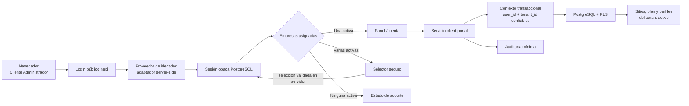

# Etapa 7A — Panel central base del Cliente Administrador

Fecha de cierre local: 2026-07-25 
Proyecto interno: Longhorn 
Marca visible: **nexi**

## A. Decisión

**Etapa 7A aprobada con deuda no bloqueante.**

La base protegida del panel de Cliente Administrador está implementada y
validada localmente. El alcance se mantuvo en consulta de sitios y plan,
edición acotada de perfiles y pantalla informativa de mensajes. No se
implementaron operaciones de la Etapa 7B, pagos, dominios, onboarding, tienda,
Supabase productivo ni despliegue.

## B. Validación previa

Antes de modificar la Etapa 7A se comprobó:

| Validación heredada de Etapa 6 | Resultado previo |
| --- | --- |
| `pnpm test:db` | 8/8 aprobadas |
| `pnpm test:auth` | 19/19 aprobadas |
| `pnpm test:admin` | 14/14 aprobadas |
| `pnpm verify` | Aprobado |
| Login `client_admin` y selección segura | Aprobado |
| Acceso separado de `nexi_admin` | Aprobado |
| Bloqueo cruzado hacia `/nexi-interno` | Aprobado |
| Membresía desactivada y empresa suspendida | Rechazadas |
| Rol web sin `BYPASSRLS` | Confirmado |
| Proveedor de test bloqueado en producción | Confirmado |

El puerto 3000 respondía a un proceso existente. No se terminó ni alteró. Las
pruebas visuales de esta etapa usaron puertos alternativos temporales 3011 y
3012; ambos procesos fueron cerrados al terminar.

## C. Arquitectura

El `tenant_id` no se toma del navegador como autoridad. El tenant activo
proviene de una sesión ya validada y se vuelve a comprobar en cada página y
mutación. Las consultas se ejecutan con `nexi_app`, rol restringido sujeto a
RLS.

## D. Rutas

| Ruta | Actor | Función | Protección |
| --- | --- | --- | --- |
| `/ingresar` | Público | Login reutilizado | Origen canónico, rate limit y proveedor server-side |
| `/seleccionar-empresa` | `client_admin` | Seleccionar o cambiar empresa | Sesión, audiencia, pertenencia y disponibilidad |
| `/cuenta` | `client_admin` | Dashboard real | Sesión + membresía + tenant activo + RLS |
| `/cuenta/sitios` | `client_admin` | Sitios en consulta | Mismo contexto tenant; sin mutaciones |
| `/cuenta/plan` | `client_admin` | Plan en consulta | Mismo contexto tenant; sin mutaciones |
| `/cuenta/datos` | `client_admin` | Perfil personal y empresarial | Contexto tenant, allowlist, CSRF, rate limit y concurrencia |
| `/cuenta/mensajes` | `client_admin` | Estado informativo | Panel protegido; sin formularios |
| `/api/client/actions` | `client_admin` | Mutaciones permitidas de perfiles | POST, origen, sesión, tenant, validación y auditoría |
| `/nexi-interno/*` | `nexi_admin` | Panel interno heredado | Audiencia separada y MFA/AAL2 |

## E. Modelo de datos

La migración 0008 incorpora un modelo mínimo, sin tablas anticipadas de
contenido, dominios, solicitudes, mensajes o pagos.

| Tabla | Propósito | Aislamiento y controles |
| --- | --- | --- |
| `user_profiles` | Teléfono, locale y versión personal | RLS por usuario; actualización propia acotada |
| `tenant_profiles` | Datos básicos de la empresa | RLS por tenant activo; versión optimista |
| `sites` | Sitios mínimos asignados | `tenant_id`, RLS, estados `preparing`, `active`, `suspended` |
| `plans` | Catálogo configurable | Solo lectura para aplicación cliente |
| `plan_features` | Características configurables | Solo lectura; evita condicionales rígidos por plan |
| `tenant_plan_assignments` | Plan vigente por empresa | `tenant_id`, estado y fechas de referencia |

Las tablas incluyen claves primarias, claves foráneas, restricciones de estado,
índices de tenant/estado y timestamps. `version` permite detectar escrituras
obsoletas en perfiles.

## F. Migraciones

- Ida: `0008_client_admin_portal.up.sql`.
- Reversa: `0008_client_admin_portal.down.sql`.
- La ida aplica sobre 0001–0007 y desde una base vacía mediante el ejecutor
  completo.
- Se probó rollback aislado de 0008 y su reaplicación.
- Conteos antes/después del ciclo: 5 tenants, 6 usuarios, 6 membresías y 17
  eventos de auditoría; no hubo pérdida.
- El primer script de medición se bloqueó por reutilizar un pool de una sola
  conexión mientras la retenía. La transacción SQL sí había terminado. Se
  corrigió el procedimiento de comprobación y se confirmó la reaplicación.
- La reversa elimina primero policies cruzadas y restaura funciones y
  restricciones heredadas compatibles con 0007.

El SQL continúa utilizando el rol propietario de migraciones; la aplicación no
puede alterar esquema.

## G. Selector multiempresa

- Una empresa activa: acceso directo a `/cuenta`.
- Varias empresas activas: selector con solo las empresas asignadas.
- Empresa suspendida o membresía desactivada: se muestra como no disponible y
  no se puede seleccionar.
- Sin empresas activas: se mantiene una sesión sin tenant activo solo para
  mostrar un estado de soporte comprensible.
- Cambio de empresa: invalida el contexto anterior y establece una nueva sesión
  validada.
- UUID o tenant ajeno enviado por el cliente: rechazado y auditado.
- Un `nexi_admin` sin membresía explícita no obtiene acceso implícito al panel.

## H. Dashboard

El dashboard consulta datos reales del tenant activo:

- nombre de empresa;
- cantidad de sitios;
- nombre y estado del plan;
- mensajes como “No disponible”, sin contador inventado;
- accesos a sitios, plan y datos.

Incluye estados reales de “sin sitios” y “sin plan”. No crea tarjetas
decorativas con cifras simuladas.

## I. Mis sitios

La lista usa `sites` y RLS para mostrar exclusivamente sitios del tenant
activo. Expone nombre, estado, creación y última actualización. No existe
“Crear sitio”, eliminación, solicitud de dominio, cambio de plantilla ni
editor. La única referencia a modificación es un estado deshabilitado y
explícito: el editor se habilitará en una etapa posterior.

## J. Mi plan

La vista muestra asignación, estado, fecha de inicio, fecha de referencia y
características configurables. Es completamente de solo lectura. No hay precio
definitivo, checkout, Flow, tarjeta, factura o cambio de plan. El plan Pro solo
se describe como preparado para funciones futuras; no afirma que la tienda esté
operativa.

## K. Mis datos

Campos personales editables:

- nombre visible;
- teléfono opcional;
- locale.

El correo de identidad se muestra en solo lectura y remite a soporte.

Campos empresariales editables:

- nombre comercial;
- nombre legal opcional;
- correo y teléfono de contacto;
- descripción breve;
- zona horaria;
- locale.

Una allowlist server-side rechaza rol, tenant, estado, proveedor, correo de
identidad e identificadores. Cada actualización usa transacción, RLS, bloqueo
de la fila, comparación de `version` y auditoría. Un conflicto devuelve 409 y
la interfaz pide recargar sin borrar los valores introducidos. El botón se
deshabilita durante el envío.

## L. Mensajes

La ruta existe y está protegida. Muestra exactamente un estado informativo:

> El centro de mensajes de nexi estará disponible próximamente. Mientras se
> habilita, utiliza el canal de soporte informado durante tu incorporación.

No contiene conversaciones, contador, formulario, correo o integración
WhatsApp.

## M. Seguridad

- Sesiones opacas almacenadas como hash.
- Audiencias de cliente e interna separadas.
- Membresía `client_admin`, usuario y tenant activos comprobados server-side.
- Tenant derivado de la sesión, no de una autoridad del navegador.
- RLS habilitada y forzada en las tablas tenant-scoped.
- Rol `nexi_app` sin `BYPASSRLS`, propiedad de esquema ni privilegios DDL.
- Origen canónico y CSRF same-origin en mutaciones.
- Rate limiting `client_mutation`.
- Validación estricta y rechazo de campos no permitidos.
- Control optimista y bloqueo de fila para evitar doble sobrescritura.
- Auditoría de acceso, cambio de contexto, ediciones y rechazos relevantes.
- Respuestas genéricas sin SQL, tokens, cookies ni payloads completos.
- Secretos exclusivamente server-side; escaneo automatizado aprobado.

## N. Archivos modificados

| Área | Archivos | Riesgo |
| --- | --- | --- |
| Esquema | `site/db/migrations/0008_client_admin_portal.*.sql` | Medio: cambia funciones de sesión; cubierto por rollback y regresión |
| Seeds | `site/scripts/db/seed.ts` | Bajo: solo local/test y datos ficticios |
| Backend cliente | `site/src/client-portal/*.ts` | Medio: autorización y mutaciones nuevas |
| Autenticación | `site/src/auth/auth-repository.server.ts`, `site/src/auth/http.server.ts` | Medio: permite estado selector sin tenant; regresión completa |
| API | `site/app/api/client/actions/route.ts` | Medio: superficie de mutación protegida |
| Selector | `site/app/seleccionar-empresa/page.tsx` | Medio: establece contexto activo |
| Panel cliente | `site/app/cuenta/**` | Bajo: interfaz nueva y aislada |
| Estilos | `site/app/globals.css` | Bajo: reglas prefijadas `client-*` y breakpoints |
| Auditoría interna | vistas de auditoría bajo `site/app/nexi-interno` | Bajo: nuevos filtros y etiquetas |
| Pruebas | DB, unitarias, integración y E2E bajo `site/tests` | Bajo |
| Automatización | `site/package.json`, `.github/workflows/ci.yml` | Bajo |
| Documentación | README e informe de esta etapa | Bajo |

No se ejecutó `git add`, no se creó commit y no se desplegó.

## O. Pruebas

| Suite | Resultado local |
| --- | --- |
| PostgreSQL/migraciones/RLS | 8/8 |
| Autenticación | 19/19 |
| Panel Administrador nexi | 14/14 |
| Cliente Administrador | 12/12 |
| Unitarias generales | 20/20 |
| Integración general | 2/2 |
| HTML renderizado | 2/2 |
| Lint | 0 errores; 3 advertencias heredadas por `` en la landing |
| Typecheck | Aprobado |
| Build | Aprobado |
| Escaneo de secretos | Aprobado |
| `pnpm verify` | Aprobado |

Los casos cliente cubren aislamiento, tenant manipulado, UUID conocido,
suspensión, membresía desactivada, sesión revocada, campos prohibidos, origen,
rate limit, auditoría y concurrencia real 200/409.

## P. E2E

- E2E autenticación heredado: 2/2.
- E2E Administrador nexi heredado: 1/1.
- E2E Cliente Administrador: 2/2.

El flujo de una empresa recorrió login, dashboard, sitios, plan, actualización
permitida, persistencia, campo prohibido, mensajes, logout y protección. El
flujo multiempresa recorrió selector, Empresa A, cambio a Empresa B, revocación
del contexto anterior, rechazo de tenant ajeno y ausencia de contaminación.

También se hizo revisión visual real en Chrome en escritorio y viewport móvil
390 × 844. Se corrigió la navegación móvil para que envuelva sus enlaces sin
desbordamiento. Las cuatro vistas internas mostraron `scrollWidth` igual a
`clientWidth`, etiquetas accesibles y jerarquía de encabezados correcta.

## Q. Integración continua

El workflow incorpora `test:client` y `test:client-e2e` junto a PostgreSQL
temporal, bootstrap, migraciones, seeds, RLS, autenticación, panel interno,
E2E heredados, `pnpm verify`, build, secretos y audit. No conecta Supabase
productivo ni despliega. La ejecución real de GitHub Actions sigue pendiente
hasta publicar una rama, acción fuera del alcance autorizado.

## R. Problemas encontrados

Corregidos:

- policies cruzadas impedían inicialmente el rollback de 0008;
- las escrituras concurrentes necesitaban bloqueo de fila además de `version`;
- las fechas SQL `date` podían desplazarse un día por zona horaria;
- la navegación móvil desbordaba horizontalmente.
- el E2E heredado dependía del nombre canónico de una empresa que una suite
  administrativa modifica; CI ahora restaura el seed sintético antes de E2E.

Heredados o diferidos:

- tres advertencias `` en la landing, sin relación con el panel;
- posible comportamiento de assets estáticos de Vinext dentro de OneDrive;
- el navegador integrado bloqueó loopback; la revisión se completó en Chrome;
- el audit online depende de conectividad al registro.

No quedan bloqueantes locales conocidos.

## S. Deuda técnica

- Conectar y validar Supabase Auth real.
- Enrolar TOTP real para Administración nexi.
- Validar recuperación e invitaciones con plantillas del proveedor.
- Definir retención y purga de sesiones, invitaciones y auditoría.
- Ejecutar GitHub Actions en una rama publicada.
- Ejecutar auditoría de dependencias con red autorizada.
- Repetir la prueba fuera de OneDrive y en staging.
- Diseñar en Etapa 7B los contratos de solicitudes y mensajería antes de crear
  sus tablas.

## T. Riesgos para staging

- **Supabase:** adaptador implementado pero aún no probado con proyecto real.
- **OneDrive:** los reparse points pueden afectar el servicio de assets del
  build Vinext en Windows; validar fuera de una carpeta sincronizada.
- **Auditoría online:** sin acceso estable al registry no se puede garantizar
  una consulta fresca de CVE.
- **CI remoto:** el workflow está definido pero no se ha ejecutado en GitHub.
- **Operación:** faltan políticas aprobadas de retención, soporte y gestión de
  incidentes.

## U. Recomendación

**La Etapa 7B puede comenzar para implementar acciones de sitios y mensajería
interna.**

La implementación debe comenzar solo después de la revisión y aprobación del
Product Owner.
