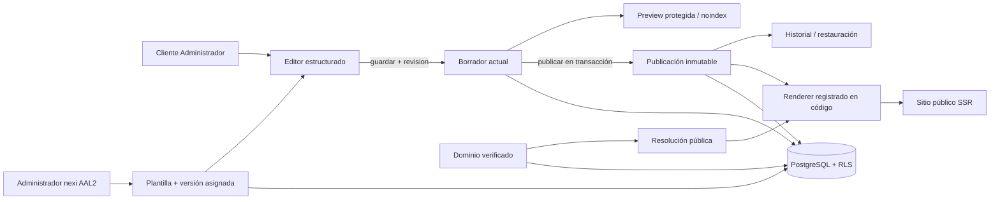

# Etapa 8A: plantillas, contenido estructurado y editor publicable

Fecha de validación local: 2026-07-26.

## Alcance y decisión de arquitectura

La etapa incorpora el primer circuito publicable para restaurantes sin crear
aplicaciones por cliente. PostgreSQL conserva las entidades centrales y un
documento JSONB validado representa el contenido `restaurant.v1`. El diseño
permanece en componentes TypeScript versionados; la base de datos solo guarda
claves declarativas, contenido estructurado y snapshots.



## Registro de plantillas y renderizadores

La migración `0010_templates_content_publication` agrega:

- `templates`: identidad, rubro y estado de una plantilla;
- `template_versions`: versión, `renderer_key`, esquema compatible y estado;
- `site_template_assignments`: asignación única por sitio y tenant;
- `site_content_drafts`: un borrador por sitio y revisión optimista;
- `site_content_publications`: snapshots inmutables y numerados;
- `sites.current_publication_id`: puntero explícito a la publicación visible.

`restaurant-classic-v1` se registra de forma explícita en
`site/src/content/renderer-registry.tsx`. La compatibilidad declarativa está en
`renderer-manifest.ts`. No existen imports construidos desde la base de datos,
`eval`, componentes serializados ni rutas controladas por clientes. Un renderer
desconocido falla de forma segura y genera auditoría acotada.

Solo un Administrador nexi con AAL2 puede asignar una versión activa. Una
versión retirada no se asigna; una deprecada ya asignada puede seguir
renderizando para permitir una migración controlada.

## Esquema canónico `restaurant.v1`

El esquema tipado comprende:

- identidad: nombre, descripción breve y lema;
- portada: titular, bajada, CTA tipada y referencia interna de imagen;
- descripción del negocio;
- carta: máximo 8 categorías y 40 ítems con UUID estables, orden,
  disponibilidad y referencia interna de imagen;
- siete días de horarios, una franja simple por día y nota;
- contacto, ubicación y enlaces HTTPS;
- redes sociales;
- title y description de SEO;
- información legal opcional del pie.

La validación server-side rechaza propiedades no declaradas, HTML, atributos
ejecutables, `javascript:`, data URL, protocolos distintos de HTTPS, correos,
teléfonos y horarios inválidos, IDs duplicados, referencias rotas y documentos
mayores a 65.536 bytes. React escapa los textos. Los borradores permiten campos
comerciales vacíos; una publicación exige el documento completo.

JSONB es apropiado porque el documento cambia como una unidad versionada,
preserva la independencia entre contenido y renderer y evita una tabla por
campo editable. No reemplaza las relaciones de tenant, sitio, plantilla,
publicación, usuario o auditoría.

## Conversión de la plantilla estática

La referencia `plantillas/brote-y-brasa-sitio.zip` se conservó intacta. Su
apariencia editorial, jerarquía, carta, historia, horarios y contacto se
adaptaron al componente `RestaurantClassicRenderer`. Los recursos visuales
internos se copiaron a `site/public/restaurant-template/images/`; no existe
carga de archivos ni aceptación de URLs de imagen arbitrarias.

| Contenido estático | Campo canónico | Componente destino | Clasificación y acción |
|---|---|---|---|
| Nombre, lema y descripción de Brote y Brasa | `identity.*` | encabezado y portada | Contenido; reemplazado por props |
| Titular, bajada y botón principal | `hero.*` | `RestaurantClassicRenderer` | Contenido y comportamiento tipado |
| Historia del restaurante | `about.*` | sección de historia | Contenido; movido al esquema |
| Categorías de carta | `menu.categories[]` | navegación de carta | Dato de demostración; seed sintético |
| Platos, descripción, precio y disponibilidad | `menu.items[]` | tarjetas de carta | Dato de demostración; seed sintético |
| Fotografías de platos | referencias de medios | portada y tarjetas | Recurso visual interno versionado |
| Horarios semanales | `hours[]` | sección de visita | Contenido; siete días tipados |
| Dirección, teléfono, correo y mapa | `contact.*` | contacto | Contenido; movido al esquema |
| Redes sociales | `social.*` | pie | Contenido; URLs HTTPS validadas |
| Title y description | `seo.*` | metadata pública | Contenido; metadata dinámica |
| Tipografía, paleta, espaciado y composición | no aplica | CSS Module | Diseño; permanece en código |
| Enlace al panel estático de demostración | no aplica | no migrado | Comportamiento administrativo eliminado |

## Borrador, preview, publicación y restauración

La inicialización administrativa crea un borrador vacío válido y no publica. Es
idempotente y no copia contenido de otro tenant.

Guardar deriva actor y tenant de la sesión, aplica contexto transaccional y RLS,
valida `restaurant.v1`, compara `revision`, actualiza solo el borrador y audita
revisiones y secciones cambiadas sin copiar el documento. Un token de
idempotencia evita duplicación y una revisión obsoleta produce conflicto.

La vista previa `/cuenta/sitios/[siteId]/preview` vuelve a autorizar la sesión,
usa el borrador, incluye `noindex` y no altera el puntero público.

Publicar valida sitio activo, tenant, membresía, plantilla, renderer y documento
completo. Dentro de una transacción crea un snapshot numerado e inmutable y
mueve `sites.current_publication_id`. Restaurar copia un snapshot histórico a
una publicación nueva, registra `restored_from_publication_id` y conserva las
versiones anteriores. La interfaz no permite borrar publicaciones.

## Resolución pública, estados y SEO

La raíz usa el hostname solo como clave normalizada contra `site_domains`
activo y verificado. `app_private.resolve_public_site` comprueba tenant, sitio,
dominio, asignación, versión y publicación. En local/test también existe
`/sitios/[siteSlug]`; el slug debe ser único y la alternativa está bloqueada
fuera de esos ambientes.

- activo con publicación: render completo;
- activo o preparing sin publicación: estado neutral y `noindex`;
- sitio suspended/archived o tenant suspendido: no disponible sin datos
  internos;
- hostname desconocido: no revela existencia ni UUID.

El canonical usa exclusivamente el dominio principal activo y verificado
persistido. La preview nunca es canonical ni indexable. Open Graph usa solo
contenido publicado validado.

## Caché

La etapa usa SSR sin caché persistente. Vinext no ofrece aún una garantía
suficientemente explícita de invalidación multi-tenant para este circuito. La
publicación o restauración se observa en la siguiente solicitud mediante el
puntero; no existe una caché global en memoria que pueda mezclar tenants.

## Seguridad, RLS y auditoría

Las cinco tablas nuevas tienen RLS. Los clientes solo leen o escriben contenido
del tenant derivado de la sesión y no pueden escribir plantillas. Las
publicaciones solo admiten `INSERT`; un trigger impide `UPDATE` y `DELETE`.
Constraints y triggers verifican tenant/sitio, esquema, plantilla y puntero.

La auditoría cubre asignación o cambio de plantilla, inicialización, guardado,
conflicto, preview, publicación, restauración, rechazo, acceso denegado,
renderer desconocido y error público. Solo guarda identificadores, revisiones,
secciones y motivos controlados.

## Seeds sintéticos

El seed incluye un restaurante publicado con dominio
`taller-laguna.nexi.cl`, un borrador diferente, un sitio sin publicación, un
sitio suspendido con publicación no servida y contenidos distintos para
tenants A y B. Todos los datos son ficticios o recursos internos.

## Comandos y pruebas

```powershell
pnpm db:reset
pnpm test:db
pnpm test:content
pnpm test:content-e2e
pnpm verify
```

`test:content` cubre esquema, registro, AAL2, inicialización, idempotencia,
concurrencia, preview, publicación, inmutabilidad, restauración, estados
públicos y aislamiento. `content-http.test.mjs` recorre el flujo administrativo
y cliente mediante HTTP.

CI agrega las pruebas de contenido tras 7B, restablece el seed canónico antes
del E2E 8A y no conecta servicios productivos.

## Deuda y riesgos

- Supabase Auth, TOTP, recuperación y correo siguen sintéticos/locales.
- La contratación, DNS y certificados de dominios siguen siendo manuales.
- No existe caché persistente; evaluar claves por `publication_id` al necesitar
  alto tráfico.
- Las imágenes son recursos internos; biblioteca y carga pertenecen a 8B.
- El build dentro de OneDrive conserva el riesgo de reparse points.
- La auditoría de dependencias requiere red; CI real debe ejecutarse en GitHub.
- No se implementaron carga multimedia, cambio de plantilla por cliente, otros
  rubros, HTML/CSS/JS editable, páginas libres, blog, reservas, tienda o pagos.
