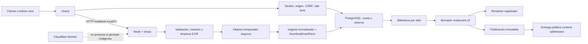

# Etapa 8B: multimedia, restaurant.v2 y segunda plantilla

## A. Decisión

**Etapa 8B aprobada con deuda no bloqueante para local/CI.**

No habilita staging ni producción: falta aprobar/conectar un proveedor de
objetos y procesamiento asíncrono. R2 queda solamente recomendado.

## B. Validación previa

Antes de modificar se verificaron PostgreSQL/RLS, autenticación, ambos paneles,
operaciones 7B, contenido 8A, E2E, lint, typecheck, build y secretos. La base
0001–0010 y el rol web restringido estaban sanos.

## C. Arquitectura

## D. Almacenamiento

- Contrato: `site/src/media/storage.ts`.
- Local/CI: `site/scripts/media/local-storage.ts`.
- Raíz predeterminada: temporal del sistema `nexi-media-{entorno}`.
- Rechaza raíz de disco, home, repo, `public/`, OneDrive y traversal.
- Key: `tenant/site/asset/checksum/(original|variants/{name}).webp`.
- Producción: no conectada. R2 recomendado; Supabase Storage sigue como opción.

## E. Modelo multimedia

0011 agrega `plan_media_capabilities`, `media_assets`, `media_variants`,
`content_media_references`, `site_template_assignment_history` y
`template_versions.preview_key`, con índices, constraints, triggers y RLS.
Estados: `processing`, `ready`, `rejected`, `failed`, `archived`.

## F. Upload

Las rutas cliente/admin derivan el actor del servidor, validan tenant/sitio,
serializan la cuota por sitio con advisory lock, reservan `processing` con
idempotencia y finalizan activo/variantes transaccionalmente. No aceptan object
key, ruta o URL.

## G. Procesamiento y privacidad

JPEG, PNG y WebP se detectan por decodificación. Se rechazan SVG, GIF, MIME
falso, corrupción, exceso de bytes, dimensiones o píxeles. `sharp` rota,
reencodifica WebP y elimina EXIF, GPS, ICC, comentarios y miniaturas.

| Variante | Ancho máximo | Uso |
|---|---:|---|
| thumbnail | 320 | Biblioteca |
| card | 768 | Ítems |
| hero | 1600 | Portada |

No se amplían imágenes pequeñas.

## H. Cuotas

Dependen del UUID/capacidades del plan, nunca de su nombre. Backend valida
cantidad, bytes, bytes por upload, formatos y capacidad. No existe bypass
informal para nexi_admin.

## I. Biblioteca

Cliente y Administrador nexi pueden listar por sitio, buscar, filtrar, paginar,
subir, editar nombre/alt predeterminado, archivar y restaurar. Un activo usado
por el borrador o publicación actual no se archiva. No hay borrado físico.

## J. Referencias

JSONB no es la única autoridad: cada uso v2 se valida en
`content_media_references`. Guardar reemplaza referencias de borrador; publicar
las copia como historial inmutable; restaurar crea una nueva publicación con
plantilla, contenido y activos de la fuente.

## K. Entrega

- Privada: `/api/media/private/{assetId}/{variant}`, autorizada y `no-store`.
- Pública: `/media/{assetId}/{variant}/{checksum}`, solo publicación actual,
  tenant/sitio activos, ETag y caché immutable.
- El original permanece privado; keys/rutas nunca se exponen.

## L–M. Restaurant.v2 y migración

`MediaUsage` contiene `assetId`, `altText` y `decorative`; rechaza URLs, keys,
rutas, HTML y campos desconocidos. Alt es obligatorio salvo decorativo.
`restaurant.v1` continúa renderizando.

La migración explícita del borrador conserva textos, IDs, orden y publicación;
resuelve bundled por sitio, falla atómicamente si falta uno, es idempotente y
auditable. No reescribe publicaciones históricas.

## N–O. Segunda plantilla y cambio

`restaurant-modern-v1` usa el mismo documento v2 y variantes, con composición
responsive distinta, accesible y sin datos comerciales hardcodeados. El
catálogo server-side filtra rubro/estado/esquema/registro. Preview es privado,
noindex y no muta. Seleccionar usa confirmación, idempotencia y concurrencia;
el sitio público cambia únicamente al publicar.

El Administrador nexi dispone también de una preview interna AAL2, de solo
lectura y auditada. El panel oculta del selector las versiones incompatibles
con el esquema del borrador; el backend vuelve a validar esa compatibilidad.

## P–Q. Seguridad, privacidad y auditoría

Se mantienen RLS, tenant confiable, AAL2 admin, origen/CSRF, rate limit,
consultas parametrizadas y transacciones. UUID opacos evitan enumeración. Se
auditan uploads, procesamiento, rechazos, cuotas, archivo, referencias,
publicación, previews, plantillas y migración, nunca bytes/base64/contenido,
URLs privadas, keys, rutas ni metadata eliminada.

## R. Migraciones

0011 aplica desde vacío y sobre 0001–0010; rollback y reaplicación fueron
probados. El down no toca objetos. `media:clean-test` es la limpieza separada.
En rollback local/test se retiran eventos 8B incompatibles con constraints
anteriores.

## S. Archivos principales

| Área | Archivos | Riesgo |
|---|---|---|
| DB/RLS | `site/db/migrations/0011_*` | Alto; rollback/RLS probados |
| Procesamiento | `site/scripts/media/*` | Alto; solo Node local/CI |
| Dominio | `site/src/media/*` | Alto; auth/cuotas/entrega |
| Contenido | `site/src/content/*` | Alto; compatibilidad v1/v2 |
| UI | rutas `multimedia`, `plantillas` y `/media` | Medio |
| CI/pruebas | `.github/workflows/ci.yml`, `site/tests/**` | Medio |

## T–V. Pruebas, E2E y CI

Las suites nuevas cubren configuración, storage seguro, formatos, metadata,
variantes, cuotas, RLS, upload real, migración, renderers y cambio. E2E ejecuta
upload, preview, publicación, entrega privada/pública, bloqueo de archivo en
uso, cambio/restauración, cruce de tenant y SVG rechazado. CI usa PostgreSQL,
directorio temporal, sidecar Node y limpieza `always()`, sin despliegue.

La prueba de plantillas incluye previews cliente y Administrador nexi, rechazo
de una versión incompatible y preservación de la publicación vigente.

| Evidencia ejecutada | Resultado |
|---|---:|
| PostgreSQL, migraciones y RLS | 8/8 |
| Autenticación | 19/19 |
| Panel Administrador nexi | 14/14 |
| Panel Cliente Administrador | 12/12 |
| Operaciones 7B | 8/8 |
| Contenido 8A | 15/15 |
| Multimedia 8B | 9/9 |
| Restaurant.v2 y plantillas | 5/5 |
| E2E multimedia HTTP | 2/2 |
| Unitarias incluidas en `pnpm verify` | 35/35 |
| Health e HTML renderizado | 4/4 |
| Lint | 0 errores; 6 advertencias `` conocidas |
| Typecheck, build y secretos | aprobados; 227 archivos inspeccionados |

Los E2E heredados se ejecutaron en la compuerta previa de regresión. La suite
multimedia nueva y la compilación final se repitieron después de los cambios
8B. La CI quedó configurada para repetir el conjunto completo en un entorno
limpio.

## W. Dependencias

`sharp@0.35.0`: versión fija, Apache-2.0, Node >=20.9, validada con Node 24 y
Windows. Solo se importa en `scripts/` y pruebas. El build no contiene el
procesador ni libvips. El audit online se intentó, pero la red del sandbox y la
elevación de egreso fueron rechazadas; no se declara aprobado.

## X–Y. Problemas y deuda

Corregidos: tipos SQL de dimensiones, bloqueo de cuota sin UPDATE de plan,
recursión RLS, permisos del trigger de historial y resolución pública
desacoplada de la plantilla de borrador.

Deuda concreta:

- proveedor/credenciales y cola productiva no autorizados;
- preview gráfico controlado por CSS, no captura generada;
- el editor v2 prioriza identidad, portada e imágenes; el resto conserva sus
  valores y puede ampliarse;
- falta confirmar audit online y CI alojada.

## Z. Riesgos para staging

R2 no conectado; prohibido OneDrive; sharp solo en worker Node de proceso; el
límite de Workers impide procesar en request; faltan cola, retención, CDN,
observabilidad y limpieza productiva; Supabase Storage no tiene decisión final.

## AA. Recomendación

La siguiente etapa puede comenzar para ampliar el catálogo de plantillas y
preparar el onboarding operativo de nuevos clientes.
