# Etapa 9A.1: cierre formal del onboarding y consolidación de la línea base

- Proyecto interno: Longhorn
- Marca visible: nexi
- Fecha de cierre: 2026-08-01
- Alcance validado: local, test y CI

## A. Decisión

**Etapa 9A aprobada con deuda no bloqueante.**

El onboarding está conectado desde la solicitud pública hasta una publicación
verificada. No quedan defectos críticos abiertos. La deuda se concentra en
proveedores, operación y controles necesarios antes de staging; staging y
producción continúan expresamente no autorizados.

## B. Problemas de cierre

| Problema | Causa | Corrección | Resultado |
|---|---|---|---|
| Modal ficticio | La prueba renderizada aún esperaba “Cafetería de barrio”, una simulación eliminada al conectar onboarding real | La prueba exige `href="/comenzar"` y confirma ausencia del texto ficticio | Renderizado 2/2 |
| Enlace `/comenzar` | La landing necesitaba una única entrada real | CTA, planes y video enlazan a `/comenzar`; no existe modal de onboarding | E2E público aprobado |
| Texto de plantillas | Una noticia heredada afirmaba tres plantillas disponibles | Se informa que hoy existen dos; la tercera permanece como objetivo futuro del MVP | Interfaz coherente con catálogo real |
| Test server-only | El test de onboarding importaba módulos `server-only` desde la tanda TSX general | `test:unit` ejecuta 35 heredadas y luego 4 de onboarding con `--conditions=react-server`, unidas por `&&` | Funciona en Windows y shell CI; una falla corta el script |

La reproducción final de `pnpm verify`, realizada después de inspeccionar el
árbol, aprobó sin correcciones adicionales. El fallo histórico queda registrado
para explicar el cambio, no se restauró la interfaz ficticia.

## C. Validación de alcance

No se implementó la Etapa 9B. No se añadió una tercera plantilla, otro rubro,
pagos, Flow, correo, WhatsApp, R2, Supabase productivo, DNS, tienda, reservas,
blog, IA ni despliegue.

Estado del catálogo:

- dos plantillas de restaurante operativas;
- tercera plantilla pendiente como objetivo aprobado del MVP.

## D. Arquitectura final de onboarding

El monolito modular TypeScript/Vinext coordina PostgreSQL/RLS, autenticación,
administración, contenido, multimedia y mensajería existentes.

```mermaid
flowchart LR
  A["Landing /comenzar"] --> B["Solicitud sin recursos operativos"]
  B --> C["Revisión nexi_admin AAL2"]
  C --> D["Conversión PostgreSQL idempotente"]
  D --> E["Identidad sintética reanudable"]
  E --> F["Caso + checklist + conversación"]
  F --> G["restaurant_onboarding.v1"]
  G --> H["Borrador determinista restaurant.v2"]
  H --> I["Preview y revisión interna"]
  I --> J["Aprobación: revisión + plantilla + checksum"]
  J --> K["Validación ready_to_publish"]
  K --> L["Primitiva de publicación existente"]
  L --> M["Resolución pública verificada"]
  M --> N["Caso published + checklist cerrado"]
```

## E. Migración 0012

`0012_operational_onboarding.up.sql` agrega solicitudes, casos, respuestas,
checklist, aprobaciones, historial y notas internas, además de índices,
constraints, triggers, funciones acotadas y RLS. La observación interna de una
solicitud manual está separada en `onboarding_intake_internal_notes`.

La validación:

1. restauró la base;
2. revirtió `0012` junto con la cadena versionada;
3. reaplicó `0001–0012`;
4. cargó el seed canónico;
5. confirmó las doce migraciones como `applied`;
6. ejecutó constraints y aislamiento 8/8.

El rollback de 0012 elimina solo su dominio y restaura constraints/funciones
anteriores. No modifica snapshots publicados ni debilita
`enforce_content_draft_consistency()`. Como no existe staging ni despliegue, la
migración sigue siendo la primera versión conceptual de 0012; no fue necesaria
una migración correctiva.

Las funciones `SECURITY DEFINER` fijan `search_path=pg_catalog`, revocan acceso
de `PUBLIC` y conceden solo `EXECUTE` específico. No hay SQL dinámico. Las ocho
tablas 9A tienen RLS y no existen privilegios generales.

## F. Formulario público

`/comenzar` es público y no exige sesión. `POST /api/onboarding/public` aplica:

- validación server-side y límite de cuerpo;
- origen canónico como protección CSRF;
- honeypot;
- rate limit por identificador privado;
- normalización y límites de campos;
- fingerprint e idempotencia;
- respuesta genérica para no revelar duplicados;
- `no-store`.

La solicitud no crea tenant, usuario, membership, sitio, plan, plantilla ni
publicación. No expone SQL, no envía correo y no llama servicios externos. El
formulario queda bloqueado fuera de local/test/CI.

## G. Conversión

La conversión prepara o reutiliza tenant/perfil, usuario/invitación, membership,
plan, sitio `preparing`, subdominio sintético, plantilla, caso, checklist y
conversación. PostgreSQL protege el bloque local con una transacción.

El proveedor de identidad está fuera de esa transacción. Por ello, el progreso
queda persistido y un reintento reanuda sin simular una transacción distribuida.
Las pruebas inyectan un fallo antes del despacho y confirman que no se duplican
tenant, usuario, invitación, membership, sitio, caso, conversación ni checklist.

## H. Caso y checklist

Estados controlados:

`received`, `pending_review`, `waiting_information`, `preparing`,
`internal_review`, `waiting_client_approval`, `ready_to_publish`, `published`,
`paused` y `canceled`.

Las transiciones se validan en backend. La pausa conserva estado anterior; la
cancelación no borra recursos. Versión optimista y bloqueos `FOR UPDATE`
rechazan escrituras obsoletas. El checklist tiene 21 elementos reales; los
obligatorios bloquean el avance.

El cliente recibe una proyección de progreso distinta del checklist interno.
No recibe prioridad, responsable, checksum, notas, errores ni IDs técnicos.

## I. Respuestas y transformación

`restaurant_onboarding.v1` recopila identidad, objetivo, CTA, historia, carta,
horarios, contacto, redes, SEO y usos multimedia. Rechaza propiedades
desconocidas, HTML/código, URLs inseguras, tamaños excesivos, IDs inconsistentes
y activos ajenos.

Las respuestas usan revisión optimista y RLS. Guardar no publica. La
transformación a `restaurant.v2` es determinista, conserva IDs y ocurre en una
transacción. Un fallo inyectado revierte borrador y referencias sin publicación
parcial.

## J. Revisión y mensajería

El detalle administrativo muestra resumen, respuestas, plantilla, multimedia,
preview, aprobación, checklist, historial, notas y auditoría. Las notas internas
viven en tablas separadas y nunca se serializan al DTO cliente.

Solicitar información crea un mensaje en `support_conversations` y un evento de
outbox sintético sin copiar el cuerpo completo. El historial interno de mensajes
no caduca. No existe correo ni integración WhatsApp.

## K. Aprobación

Cada aprobación vincula:

- `onboarding_case_id`;
- `site_id`;
- revisión del borrador;
- `template_version_id`;
- schema key y versión;
- checksum lógico;
- actor y fecha.

Triggers de base de datos invalidan la aprobación ante cambios de borrador,
plantilla o referencias multimedia. La invalidación devuelve el caso a
preparación y reinicia el checklist correspondiente. Una aprobación obsoleta no
permite marcar listo ni publicar, incluso mediante llamada directa.

## L. Publicación

Onboarding reutiliza `publishContentTransaction`, extraída del servicio de
contenido existente. No existe otra lógica de snapshots, numeración,
`template_version_id`, referencias, `current_publication_id` ni historial.

Antes de publicar valida tenant, membership, sitio, plan, plantilla, renderer,
borrador `restaurant.v2`, multimedia `ready`, dominio/subdominio, checklist,
revisión, plantilla y checksum aprobados. Dos intentos concurrentes y sus
reintentos producen una publicación y un cierre. El caso solo pasa a
`published` después de resolver el sitio público y comprobar publicación,
renderer y contenido.

Los tests heredados confirman además que sitios archivados/suspendidos, tenants
suspendidos, renderer desconocido y datos no publicables fallan cerrados.

## M. Seguridad

- `tenant_id` proviene de sesión confiable, nunca del navegador;
- RLS y autorización server-side se aplican juntas;
- `nexi_app` y `nexi_migrator` no tienen `BYPASSRLS`;
- los repositorios web no abren conexiones de migración/administración;
- `nexi_admin` requiere AAL2;
- `client_admin` no convierte, cambia estados administrativos ni publica;
- UUID conocido no concede acceso;
- notas y auditoría no son accesibles al cliente;
- origen, rate limit, honeypot e idempotencia protegen entrada/mutaciones;
- tokens, cookies, contraseñas, cuerpos y secretos no entran en auditoría;
- adaptadores sintéticos/locales fallan cerrados fuera de local/test/CI.

## N. Compatibilidad 8B.1

La secuencia exacta final:

`test:prepare-base → test:content → media:seed → test:media → test:templates`

aprobó 15/15, 9/9 y 5/5 sin SQLSTATE `23514`, estado `archived`
contaminante, asignaciones/activos/referencias parciales ni publicaciones
duplicadas.

Onboarding no modificó la restauración `finally`, precondiciones, transacción
única, compensación de objetos, idempotencia ni reset canónico de 8B.1.

## O. UX y textos comerciales

La landing:

- enlaza a `/comenzar` desde sus CTA;
- no contiene modal ni simulación de onboarding;
- no muestra acceso del Administrador nexi;
- usa “nexi” en minúsculas;
- informa dos plantillas disponibles;
- no promete staging, producción ni capacidades inexistentes;
- no revela detalles técnicos.

El objetivo futuro de una tercera plantilla permanece documentado, pero no se
presenta como disponible.

## P. Archivos modificados

| Archivo o grupo | Cambio | Motivo | Riesgo |
|---|---|---|---|
| `db/migrations/0012_*` | Modelo 9A, invariantes, RLS y rollback | Persistencia del flujo | Alto, cubierto por 8/8 y rollback |
| `src/onboarding/*` | Validación, estados, conversión, aprobación y publicación | Dominio 9A | Alto, cubierto por integración/E2E |
| `src/content/service.server.ts` | Primitiva transaccional reutilizable | Evitar segunda publicación | Alto, cubierto por 8A/E2E |
| `app/comenzar`, `app/api/onboarding` | Entrada pública real | Sustituir simulación | Medio |
| `app/nexi-interno/**/onboarding` | Bandeja y operación AAL2 | Back office | Medio |
| `app/cuenta/incorporacion` | Respuestas, progreso y aprobación | Flujo cliente | Medio |
| `app/landing-client.tsx` | Enlaces reales y dos plantillas actuales | Coherencia comercial | Bajo |
| `scripts/onboarding/*` | Seed/status/reset sintéticos seguros | Repetibilidad | Medio |
| `tests/**/onboarding*` | Unitarias, integración y E2E | Cobertura 9A | Bajo |
| `tests/rendered-html.test.mjs` | Valida `/comenzar`, no modal ficticio | Cierre 9A.1 | Bajo |
| `package.json`, `.env.example` | Scripts y variables no secretas | Operación local/CI | Bajo |
| `.github/workflows/ci.yml` | Restauraciones, suites y limpieza 9A | Línea base CI | Medio |
| README, informe y ADR-008 | Documentación viva | Trazabilidad | Bajo |

No se ejecutó `git add`, commit, push ni despliegue.

## Q. Pruebas

| Grupo | Resultado |
|---|---:|
| PostgreSQL/RLS | 8/8 |
| Autenticación | 19/19 |
| Administrador nexi | 14/14 |
| Cliente Administrador | 12/12 |
| Operaciones 7B | 8/8 |
| Contenido 8A | 15/15 |
| Seed multimedia 8B.1 | 4/4 |
| Multimedia 8B | 9/9 |
| Plantillas | 5/5 |
| Onboarding (especializada) | 5/5 |
| Unitarias heredadas | 35/35 |
| Unitarias onboarding | 4/4 |
| **Total unitarias** | **39/39** |
| Health | 2/2 |
| Renderizado | 2/2 |
| E2E heredados | 9/9 |
| E2E onboarding | 1/1 |
| **Total E2E** | **10/10** |
| Lint | 0 errores, 6 advertencias heredadas |
| Typecheck | Aprobado |
| Build | Aprobado |
| Secretos | 256 archivos, aprobado |
| Auditoría de dependencias mediante `pnpm audit` | Sin vulnerabilidades críticas ni altas |

Las suites especializadas combinan algunas pruebas unitarias e integración; sus
totales no deben sumarse como si fueran casos únicos. `pnpm verify` incluye las
39 unitarias exactamente una vez.

## R. E2E

Los diez casos se ejecutaron sobre bases preparadas independientemente:

- autenticación: 2;
- administración: 1;
- Cliente Administrador: 2;
- operaciones: 1;
- contenido/publicación: 1;
- multimedia/plantillas: 2;
- onboarding: 1.

El E2E 9A cubre solicitud pública, origen/honeypot, idempotencia, AAL2,
conversión, invitación sintética, acceso cliente, respuestas, borrador,
preview `noindex`, aprobación, listo, publicación, página pública, rate limit y
cierre verificado.

## S. `pnpm verify`

Resultado final: **aprobado en 35,8 segundos**.

Pasos:

1. lint: 0 errores y 6 advertencias heredadas;
2. TypeScript: aprobado;
3. unitarias heredadas: 35/35;
4. unitarias onboarding server-only: 4/4;
5. health: 2/2;
6. build Vinext: aprobado;
7. renderizado: 2/2;
8. secretos: 256 archivos aprobados.

El operador `&&` en `test:unit` conserva el código de salida: si falla la tanda
heredada no se ejecuta la segunda; si falla onboarding el script termina con su
error. Se validó en Windows y la sintaxis es compatible con el shell Linux de
CI.

## T. CI

`.github/workflows/ci.yml` configura PostgreSQL temporal, roles, migraciones,
seed, almacenamiento temporal, RLS, autenticación, paneles, operaciones,
contenido, media seed, multimedia, plantillas, onboarding, comandos sintéticos,
los E2E, `verify` y auditoría de dependencias mediante `pnpm audit`.

Restaura la base antes de bloques mutables y limpia procesos/artefactos
sintéticos. No despliega, no contiene secretos reales y no conecta Supabase,
R2, correo ni otros proveedores productivos. Cualquier comando no cero falla el
job. Al momento de este cierre histórico, la ejecución alojada real continuaba
pendiente; su comprobación posterior se registra en la sección AA.

## U. Documentación

Actualizados:

- `docs/etapa-9a-onboarding-operativo.md`;
- `docs/adr/ADR-008-orquestacion-onboarding-y-aprobacion.md`;
- `docs/README.md`;
- `site/README.md`;
- README raíz;
- `.env.example`;
- workflow de CI.

La documentación no contiene secretos ni rutas personales. Los documentos
históricos se conservan; esta línea base viva registra las diferencias.

## V. Problemas encontrados

Corregidos:

- aserción del modal ficticio;
- texto visible de tres plantillas;
- condición React Server de las unitarias;
- orden final de escenarios avanzados del seed frente a triggers;
- limpieza de referencias foráneas sintéticas.

Ambiental, resuelto:

- Docker/PostgreSQL no estaba iniciado al repetir la compuerta el 2026-08-01;
  la tanda `ECONNREFUSED` se descartó y toda la validación se repitió desde cero.

Heredados no bloqueantes:

- seis advertencias `no-img-element`, ninguna nueva por 9A.1;
- Vinext clasifica algunas rutas dinámicas como desconocidas durante análisis
  estático, aunque build y E2E aprueban.

Bloqueantes: ninguno.

## W. Deuda técnica

- Supabase Auth, TOTP y recuperación reales;
- almacenamiento de objetos y procesamiento multimedia productivos;
- cola y CDN;
- entrega transaccional real del outbox/correo;
- política de retención para auditoría y outbox; mensajes no caducan;
- observabilidad de conversión, reintentos y verificación;
- backups y restore operativo;
- pruebas de carga;
- ejecución alojada del workflow, pendiente al momento de este cierre y
  comprobada posteriormente en el PR #3 (sección AA);
- tercera plantilla de restaurante.

La auditoría de dependencias mediante `pnpm audit` aprobó localmente; debe seguir
ejecutándose en CI y antes de cada promoción.

## X. Riesgos para staging

Staging no debe habilitarse hasta aprobar y validar:

- Supabase Auth/TOTP/recuperación;
- proveedor de objetos (R2 solo recomendado, no conectado);
- procesamiento, cola y CDN;
- DNS y certificados;
- correo transaccional;
- retención, observabilidad, backups y restore;
- CI alojada y audit continuo;
- ejecución fuera de OneDrive;
- carga, cuotas y recuperación ante fallos.

## Y. Diferencias respecto del plan

- La compuerta inicial del cierre encontró Docker detenido, no un defecto de
  aplicación. Se levantó PostgreSQL y se repitió toda la evidencia.
- La aprobación no caduca por tiempo: se invalida por revisión, plantilla,
  esquema o multimedia. Esto es coherente con la regla vigente de no caducidad
  de mensajes y evita agregar una política no aprobada.
- La auditoría online, inicialmente bloqueada por sandbox, se ejecutó con acceso
  autorizado y aprobó. En ese momento la ejecución continua alojada seguía
  pendiente; fue comprobada posteriormente como se registra en la sección AA.
- No se añadió cobertura artificial ni se redujo una prueba para obtener verde.

## Z. Recomendación

La Etapa 9B puede comenzar para implementar la tercera plantilla de restaurante,
gobierno del catálogo y preparación del piloto.

No debe comenzar hasta que el Product Owner revise y apruebe formalmente este
cierre.

## AA. Actualización posterior de la evidencia alojada

El 2026-08-04 se comprobó la ejecución alojada correspondiente al Pull Request
#3 sobre el SHA exacto
`830345bd15796274826ee088e9fcf64ea89eabad`.

| Evidencia | Valor comprobado |
| --- | --- |
| Pull Request | #3 |
| Workflow | `CI` |
| Ejecución | `30877506500` |
| Job | `91891835577` (`Verify application`) |
| Evento | `pull_request` |
| SHA evaluado | `830345bd15796274826ee088e9fcf64ea89eabad` |
| Resultado | `success` |
| Pasos fallidos | 0 |

La ejecución incluyó instalación congelada, PostgreSQL temporal, roles,
migraciones, seed, RLS, autenticación, paneles, operaciones, contenido,
multimedia, plantillas, onboarding, E2E, build, escaneo de secretos y auditoría
de dependencias mediante `pnpm audit`.

Esta evidencia cierra exclusivamente la condición histórica de CI alojada y
habilita la revisión humana final del PR. No autoriza merge automático, staging,
producción, proveedores productivos ni el inicio de la Etapa 9B.
